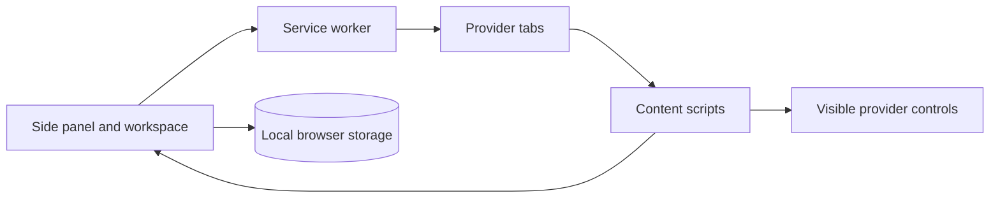

# Council

Council is a Chrome extension for sending one task to multiple AI websites and following their responses in one workspace. It uses the browser sessions you already have open for ChatGPT, Claude, Gemini, Grok, and Kimi.

Council does not require API keys, a backend, or a separate account. Provider interaction happens through visible page elements in normal Chrome tabs.

## Status

Council is under active development. The current build includes:

- Chrome Manifest V3 extension shell
- Side panel and full workspace
- Provider tab detection, reuse, and grouping
- ChatGPT, Claude, Gemini, Grok, and Kimi adapters
- Prompt submission through visible page controls
- Live response updates using `MutationObserver`
- Full-height live room with one response lane per provider
- Direct shortcuts from each response lane to the provider tab
- Compact side-panel session monitor
- Local run state and IndexedDB persistence
- Connection diagnostics with matched selectors and recovery details

Peer review, revision, final synthesis execution, history management, and exports are not complete yet.

## Requirements

- Google Chrome 116 or newer
- Node.js 20 or newer
- An active browser session for each provider you want to use

## Install from source

```bash
npm install
npm run build
```

Then:

1. Open `chrome://extensions`.
2. Enable **Developer mode**.
3. Select **Load unpacked**.
4. Choose the generated `dist` directory.
5. Click the Council toolbar icon to open the side panel.

After rebuilding, reload Council from `chrome://extensions`.

## Development

```bash
npm run dev
npm run typecheck
npm test
npm run build
```

## How it works



The service worker finds or opens provider tabs. A provider-specific content script fills the visible composer, submits the prompt, and observes the latest assistant message. Typed runtime messages stream response updates into separate provider lanes in the live room.

Provider adapters and selectors are isolated under `src/content/providers`. Shared DOM interaction code is under `src/content/shared`.

## Privacy and permissions

Council keeps prompts, responses, settings, and run history in local browser storage. It does not read cookies, passwords, authentication tokens, private request headers, or browser history. It does not call undocumented provider APIs or send conversations to a Council server.

The extension requests access only to supported provider domains and the Chrome APIs required for tabs, tab groups, storage, scripting, and the side panel.

## Updating provider selectors

Provider interfaces change over time. When an adapter stops matching a page:

1. Inspect stable attributes such as `role`, `aria-label`, `data-*`, and `contenteditable`.
2. Update that provider's fallback selectors in `src/content/providers/provider-config.ts`.
3. Add or update a sanitized HTML fixture and selector test.
4. Run the test and build commands before submitting a change.

Do not add generated class names, network interception, authentication storage access, or private provider endpoints.

## Contributing

Open an issue before making a large change. Keep provider-specific behavior inside its adapter, add tests for behavior changes, and verify the production build before opening a pull request.

## Limitations

- Provider page changes can break DOM selectors.
- CAPTCHAs, verification prompts, and sign-in steps require user action.
- Automated tests cannot fully reproduce authenticated provider sessions.
- Provider websites remain in normal Chrome tabs and cannot be embedded in the extension workspace.

## License

[MIT](LICENSE)
